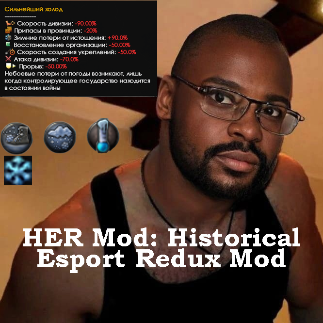

# HER MOD: Revival

> **HER MOD: Revival** — исторический multiplayer overhaul для Hearts of Iron IV, построенный вокруг оперативной войны, логистики и многолетнего истощения.
>
> В HER недостаточно выиграть бой. Нужно суметь подготовить наступление, снабдить его, развить прорыв, пережить контрудар и восстановить армию после того, как операция закончится.

## Что такое HER?

HER — это многолетняя переработка Hearts of Iron IV, создаваемая прежде всего для **организованных исторических мультиплеерных партий на низкой скорости**.

Цель мода — не просто добавить больше технологий, фокусов, техники или исторических событий. HER меняет сам характер войны.

В ванильной Hearts of Iron IV успешный прорыв нередко быстро превращается в обрушение целого фронта. В HER взятая провинция — ещё не победа, удачный бой — ещё не успешная операция, а численное превосходство — ещё не гарантия продвижения.

Армия может прорвать фронт и остановиться через несколько провинций из-за истощения. Танковый корпус может выполнить задачу и потерять значительную часть техники. Наступление может закончиться неудачей на карте, но заставить противника перебросить авиацию и мобильные резервы с другого направления.

И наоборот: можно удержать территорию и одновременно проигрывать войну, если лучшие соединения постепенно уничтожаются быстрее, чем страна способна их восстановить.

HER строится вокруг этой логики.

> **Война решается не одной битвой. Она решается тем, какая сторона дольше способна планировать операции, снабжать армию, восполнять потери и сохранять стратегическую инициативу.**

---

## Как играется война в HER

Крупное наступление — это не просто нарисованная стрелка.

Перед атакой приходится учитывать:

- состояние железных дорог и узлов снабжения;
- пропускную способность тыла;
- погоду и состояние местности;
- наличие топлива;
- концентрацию собственной и вражеской авиации;
- расположение мобильных резервов противника;
- состояние танковых и специализированных соединений;
- наличие резервной армии для развития успеха;
- способность промышленности восполнить ожидаемые потери.

Даже после успешного прорыва операция только начинается.

Танковые части теряют организацию и технику. Снабжение отстаёт от фронта. Противник перебрасывает резервы. Авиацию приходится переносить на новые аэродромы. Измотанные дивизии необходимо менять свежими.

Поэтому продвижение в HER часто происходит **серией ограниченных операций**, а не непрерывным движением фронта.

Иногда разумнее остановиться.

Иногда — дождаться окончания распутицы.

Иногда — построить новый узел снабжения.

А иногда несколько месяцев подготовки заканчиваются тем, что:

> *«Как прорвались, так и нахуй.»*

---

## Оперативная война

Основной масштаб сухопутной войны в HER находится между отдельным боем и глобальной стратегией.

Игрок управляет не только тем, **где атаковать**, но и тем, **как создать условия для атаки**.

Операция может строиться вокруг:

- захвата или изоляции узла снабжения;
- перерезания железной дороги;
- обхода укреплённого города;
- концентрации танковых корпусов;
- выманивания мобильного резерва противника;
- открытия второго участка фронта;
- временного превосходства в воздухе;
- форсирования реки после подготовки;
- десанта в оперативном тылу.

Это делает географию важной.

Воронеж, Сталинград, Ростов, Крым или любой другой район имеют значение не только как победные очки. Их ценность определяется дорогами, реками, портами, аэродромами, снабжением, местностью и положением относительно других участков фронта.

---

## Война на истощение

HER не стремится к тому, чтобы армии мгновенно разваливались после первого проигранного сражения.

Особенно в поздней войне фронт может оставаться устойчивым очень долго.

Но за этой внешней устойчивостью постепенно меняется состояние армии.

Сначала страна располагает свежими мобильными резервами и может перебрасывать их с одного кризисного участка на другой.

Потом эти соединения начинают терять:

- танки;
- самоходную артиллерию;
- мототехнику;
- опыт;
- организационную устойчивость;
- возможность быстро восстанавливаться после боя.

Ещё позже танковые части, которые раньше использовались для наступления, всё чаще становятся пожарными командами, закрывающими чужие прорывы.

Сам фронт при этом может двигаться медленно.

Но стратегическое положение уже изменилось.

> **Одна из сторон постепенно теряет не территорию, а способность продолжать войну в прежнем качестве.**

Именно поэтому промышленность, резервы и долгосрочная структура армии в HER не менее важны, чем непосредственные боевые характеристики.

---

## Победа в операции — не всегда движение фронта

HER сознательно допускает ситуации, в которых результат нельзя оценить только по цвету карты.

Неудачный десант может заставить противника оставить на второстепенном театре десятки дивизий.

Тяжёлое наступление может считаться успешным, если в нём уничтожены ценные мобильные соединения противника.

Взятый город может не оправдать цену операции.

А потерянная территория может быть сознательно оставлена ради сохранения армии.

Стратегический результат операции может заключаться в том, что противник:

- потерял технику;
- исчерпал резерв;
- перебросил авиацию;
- снял танки с другого участка;
- потерял логистический узел;
- оказался вынужден удерживать дополнительный театр войны.

Поэтому в HER важно не только **куда дошёл фронт**, но и **в каком состоянии обе армии дошли до этой линии**.

---

## Снабжение и логистика

Снабжение — одна из центральных систем войны.

Железные дороги и логистические узлы определяют, где вообще возможно долго концентрировать крупную группировку.

Чем дальше движется армия, тем сложнее поддерживать первоначальный темп.

На практике игрокам приходится:

- заранее развивать железнодорожную сеть;
- восстанавливать инфраструктуру вслед за наступлением;
- строить новые узлы снабжения;
- защищать существующие коммуникации;
- учитывать потребление крупных танковых группировок;
- ограничивать количество войск на перегруженном участке;
- использовать порты и морские коммуникации;
- при необходимости организовывать воздушное снабжение.

Захваченный хаб не означает автоматически решённую проблему.

Снабжение должно ещё **дойти до него и от него — до армии**.

Логистика здесь не существует отдельно от боевой системы. Она непосредственно определяет продолжительность наступления и количество войск, которое можно использовать на выбранном направлении.

---

## Погода и местность

Погода в HER — не декоративный модификатор.

Она может определять сам момент начала операции.

Слякоть, снег, мороз, жара, состояние грунта и особенности стратегического региона влияют на способность армии использовать технику и поддерживать темп наступления.

Игрок может обладать готовой ударной группировкой и всё равно ждать несколько недель, потому что условия для наступления ещё не наступили.

Карта и погодные регионы переработаны с целью сделать различные театры войны действительно различными по характеру.

Война на Украине, в Белоруссии, Крыму, Скандинавии, Северной Африке или на Кавказе не должна ощущаться одинаково.

---

## Танковые войска и мобильные резервы

Танковые соединения — один из самых ценных ресурсов армии.

Они способны:

- создавать прорыв;
- контратаковать наступающего противника;
- закрывать кризисные участки;
- развивать успех;
- завершать окружения.

Но они дороги.

Тяжёлая операция может уничтожить значительную часть бронетехники даже у победившей стороны.

Поэтому танковая дивизия ценна не только своими характеристиками в конкретном бою. Важно, сможет ли страна:

- заменить потерянные машины;
- восстановить специализированное оснащение;
- сохранить опыт соединения;
- вернуть корпус на фронт до следующего кризиса.

В поздней войне особенно хорошо заметна разница между армией, у которой ещё существуют свежие мобильные резервы, и армией, которая продолжает закрывать фронт всё более истощёнными танковыми частями.

---

## Специализированные соединения

Различные типы дивизий выполняют разные задачи.

Сильное соединение не обязательно является универсальным.

Например, часть с огромной артиллерийской огневой мощью может быть великолепна для первого удара, но быстро потерять организацию и оказаться непригодной для длительного наступления.

Другие соединения лучше подходят для:

- удержания фронта;
- форсирования;
- городского боя;
- поддержки танковых атак;
- действий в сложной местности;
- развития прорыва;
- обороны от авиации.

HER стремится к тому, чтобы структура армии определялась предполагаемым способом её применения, а не существованием одного универсального шаблона.

---

## Авиация

Воздушная война — самостоятельный промышленный и оперативный фронт.

Авиацию недостаточно просто произвести.

Необходимо:

- разработать подходящую технику;
- распределить промышленность между типами самолётов;
- обеспечить аэродромы;
- правильно выбирать воздушные регионы;
- концентрировать истребители;
- прикрывать ударную авиацию;
- восстанавливать понёсшие потери авиакрылья.

Воздушное превосходство может определять исход наземной операции, а потеря нескольких тысяч машин — повлиять на способность страны вести войну в следующие месяцы.

Развитие авиации, конструкторы, модули, технологии и специализация стран переработаны и являются частью общей системы вооружённых сил.

---

## Флот и десантные операции

Морская война также связана с сухопутной.

Флот нужен не только для уничтожения флота противника.

Он обеспечивает:

- морские коммуникации;
- безопасность конвоев;
- снабжение удалённых театров;
- высадки;
- поддержку прибрежных операций;
- борьбу с подводными лодками.

Комбинированная операция может одновременно требовать работы флота, транспортной авиации, ВДВ, морского десанта, истребителей и наземной армии.

Если хотя бы одна часть этой системы разваливается, весь плацдарм может оказаться под угрозой.

HER специально оставляет пространство для рискованных операций, которые способны дать большой стратегический эффект — или превратиться в дорогостоящую авантюру.

---

## Экономика и цена большой войны

Военная экономика в HER существует не только ради увеличения количества заводов.

Подготовка к войне начинается задолго до первого выстрела.

Государству необходимо определить:

- какую армию оно собирается строить;
- какие виды вооружения станут приоритетными;
- сколько промышленности уйдёт на авиацию и флот;
- какие ресурсы понадобятся;
- какие запасы необходимо создать;
- насколько далеко можно мобилизовать экономику до начала серьёзных внутренних последствий.

Длительная война постепенно меняет страну.

Мобилизация, людские потери, экономическое напряжение, стабильность и политические механики создают долгосрочные последствия.

Особенно это заметно в поздней войне, когда государство может формально сохранять огромную промышленность и армию, но одновременно входить в фазу экономического и политического кризиса.

---

## Запасы и ресурсы

Ресурсная экономика HER не ограничивается текущим дневным балансом.

Система складов позволяет создавать стратегические запасы ресурсов и использовать их для покрытия дефицита во время войны.

Это делает довоенную подготовку важнее: страна может заранее готовиться к будущей блокаде, потере торговых партнёров или резкому росту военного производства.

Торговля, доступ к ресурсам и решения по экономической изоляции способны иметь последствия спустя годы после начала кампании.

---

## Ленд-лиз и союзная экономика

Союзники в HER связаны не только общей фракцией.

Ленд-лиз способен непосредственно поддерживать способность страны продолжать войну.

Потерянные танки, самолёты, грузовики или другое оборудование не всегда должны быть восполнены только собственной промышленностью.

Сильный альянс распределяет нагрузку.

Одна страна может делать основной вклад на суше, другая — обеспечивать авиацию, флот, ресурсы или материальную помощь.

Поэтому баланс HER рассматривает не каждую страну изолированно, а **противостоящие коалиции**.

---

## Государство, политика и национальный контент

HER начинается в 1936 году задолго до основной мировой войны.

Национальные фокусы, идеи, события и решения определяют:

- скорость перевооружения;
- политические ограничения;
- структуру экономики;
- международные отношения;
- доступ к ресурсам;
- мобилизацию;
- развитие вооружённых сил;
- положение государства к моменту начала войны.

Основной объём глубоко переработанного национального контента сосредоточен на ключевых державах кампании:

- Великобритании;
- Германии;
- США;
- Франции;
- Японии;
- СССР.

Именно вокруг их взаимодействия, подготовки и военных ролей строится основная историческая структура HER.

---

## Технологии, конструкторы и вооружение

HER значительно расширяет развитие вооружённых сил.

Переработаны и дополнены:

- сухопутные технологии;
- артиллерия;
- бронетехника;
- авиация;
- флот;
- промышленность;
- электроника;
- модули техники;
- специальные проекты;
- военно-промышленные организации и конструкторы.

Специализация должна иметь цену.

Страна не может одновременно получить лучшее из всех возможных направлений.

Выбор технологии или конструктора определяет, **какую именно войну государство готовится вести через несколько лет**.

---

## Доктрины и командование

HER сохраняет классическую концепцию развития доктрин через накопленный военный опыт и перерабатывает систему командования вокруг собственных потребностей мода.

Генералы, командирские характеристики, способности и специализации имеют значение при формировании конкретных армий и оперативных группировок.

Командир должен соответствовать задаче, которую выполняют его войска.

---

## Оккупация и партизанская война

Захват территории не означает автоматического контроля над ней.

Оккупированные регионы требуют:

- гарнизонов;
- ресурсов;
- времени;
- антипартизанских действий.

Особенно значима эта система на крупных сухопутных театрах, где продвижение на сотни километров создаёт огромный оккупированный тыл.

Чем дальше продвигается армия, тем больше ресурсов требуется не только на фронт, но и на удержание уже занятой территории.

---

## Историчность без заранее написанного результата

HER стремится создавать **исторические условия**, а не гарантировать исторический исход.

Германия получает свои сильные стороны и свои ограничения.

СССР — свои.

Союзники — свои.

Если одна сторона плохо подготовилась, неверно распределила промышленность, сорвала снабжение или не открыла необходимый второй фронт, результат войны закономерно будет отличаться от реальной истории.

Мод не должен искусственно возвращать кампанию к исторической линии после каждой ошибки игроков.

Историчность HER заключается в том, чтобы государства сталкивались с узнаваемыми проблемами эпохи:

- нехваткой ресурсов;
- огромными расстояниями;
- необходимостью вести войну на нескольких фронтах;
- промышленным истощением;
- ограниченным количеством качественных резервов;
- зависимостью от союзников;
- погодой;
- логистикой;
- политическими последствиями затяжной войны.

А уже результат создают игроки.

---

## Multiplayer прежде всего

HER разрабатывается в первую очередь для игры **людей против людей**.

Основной формат:

- организованные исторические партии;
- распределение главных держав между игроками;
- командное управление странами;
- низкая скорость во время крупных войн;
- координация внутри альянса;
- длительные кампании из нескольких игровых сессий.

Низкая скорость — часть дизайна.

Она нужна не ради искусственного увеличения продолжительности партии, а потому что игрок одновременно управляет:

- несколькими армиями;
- резервами;
- авиацией;
- производством;
- логистикой;
- союзными операциями.

HER не стремится превращать результат войны в соревнование по скорости кликов.

### А что с ИИ?

ИИ способен занимать свободные страны, но **AI overhaul не является приоритетом разработки HER**.

Баланс и механики в первую очередь создаются вокруг ситуаций, в которых ключевые страны находятся под управлением игроков.

Поэтому одиночная партия возможна, но не является главным форматом, вокруг которого строится мод.

---

## Для кого HER?

HER стоит попробовать, если вам нравится:

- исторический multiplayer;
- длинная кампания с 1936 года;
- низкая скорость во время войны;
- оперативное планирование;
- логистика;
- экономика и подготовка до войны;
- командная игра;
- специализированные армии;
- большие фронты;
- постепенное истощение противника;
- необходимость думать на несколько месяцев вперёд.

HER, скорее всего, не подойдёт, если вы хотите:

- быструю аркадную кампанию;
- постоянную игру на высокой скорости;
- универсальную мету для всех стран;
- возможность игнорировать снабжение и экономику;
- войну, в которой один удачный прорыв автоматически решает весь фронт;
- мод, ориентированный прежде всего на AI и одиночную игру.

---

## Четыре года разработки

HER создавался и перерабатывался на протяжении нескольких лет.

За это время проект неоднократно менял собственные системы, баланс и представление о том, какой должна быть война в Hearts of Iron IV.

Большая часть решений проверяется не только по файлам и формулам, но и в длительных multiplayer-кампаниях.

Именно там становится понятно, работает ли механика на практике.

Не по тому, насколько красиво выглядит отдельный бонус.

А по тому, заставляет ли он игроков принимать интересные решения спустя несколько лет игрового времени.

HER продолжает развиваться.

---

## Установка

Подпишитесь на мод в Steam Workshop:

**HER MOD: Revival**  
https://steamcommunity.com/sharedfiles/filedetails/?id=3722982111

Убедитесь, что используете поддерживаемую версию Hearts of Iron IV, указанную в начале README.

---

## Статус проекта

HER MOD: Revival находится в активной разработке.

Баланс, национальный контент, локализация, карта и отдельные механики продолжают дорабатываться по результатам тестовых и полноценных multiplayer-партий.

Ошибки, предложения и наблюдения по балансу приветствуются — особенно если они основаны на реальной игровой ситуации, а не только на сравнении отдельных цифр вне контекста.

---

> **HER — это мод о войне, в которой взять провинцию недостаточно.  
> Нужно ещё суметь удержать темп, сохранить армию и пережить следующую операцию.**
